# IPL Data Analysis & Insights

The dataset contains **1169** unique matches across **278205** ball-by-ball deliveries.

Here are 12 key insights derived from the robustly cleaned data, along with their visualizations:

## 1. Overall Statistics - Identified matches played across 18 seasons
> [!TIP]
> Identified matches played across 18 seasons. The number of matches per season fluctuates but generally hovered around 60, increasing recently with more teams.

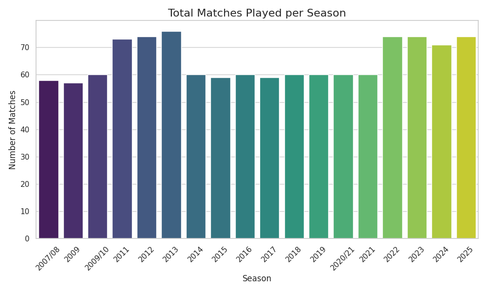

## 2. Team Performance - Mumbai Indians and Chennai Super Kings dominate the history of IPL in terms of total match wins
> [!TIP]
> Mumbai Indians and Chennai Super Kings dominate the history of IPL in terms of total match wins.

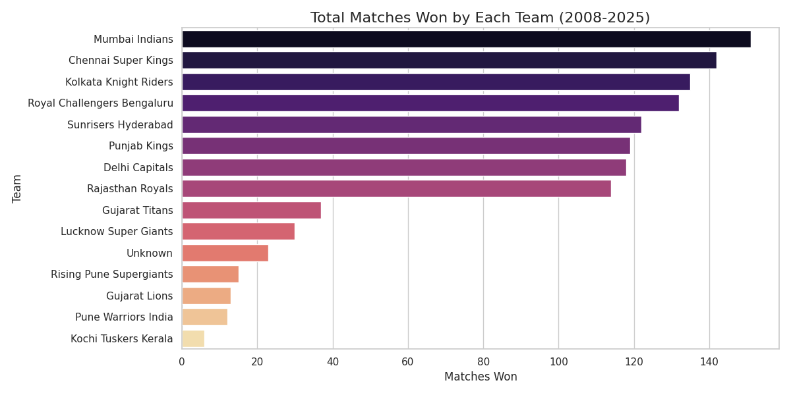

## 3. Match Dynamics - Teams overwhelmingly prefer to field first (65
> [!TIP]
> Teams overwhelmingly prefer to field first (65.4%) after winning the toss.

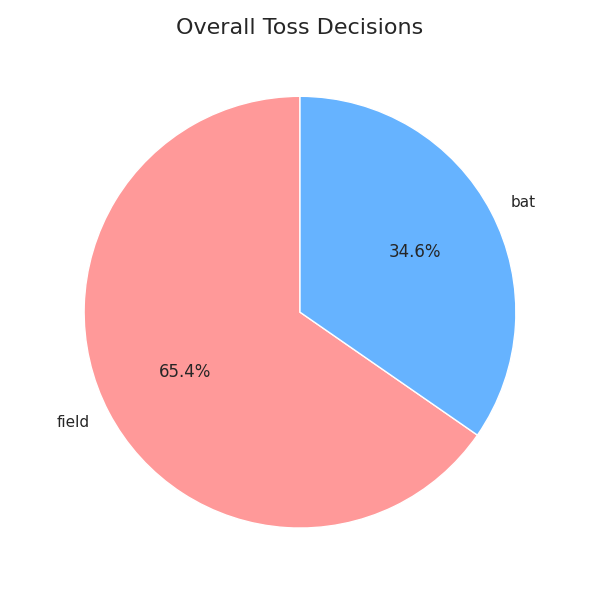

## 4. Match Dynamics (Time Series) - There's a clear trend where the preference for fielding first has increased significantly in later seasons compared to earlier seasons
> [!TIP]
> There's a clear trend where the preference for fielding first has increased significantly in later seasons compared to earlier seasons.

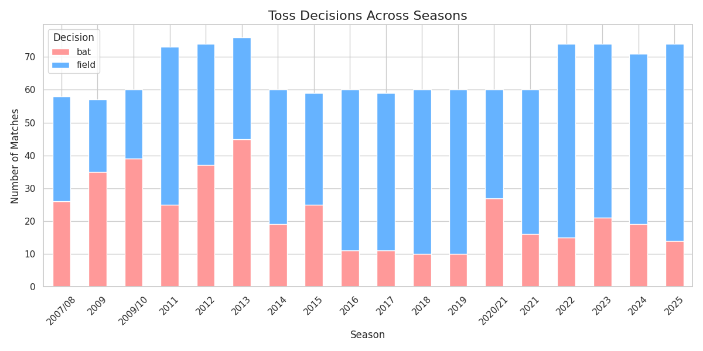

## 5. Venue Analysis - Venues vary significantly in scoring
> [!TIP]
> Venues vary significantly in scoring. Himachal Pradesh Cricket Association Stadium averages 183 runs, heavily favoring batters, while Newlands is much lower scoring.

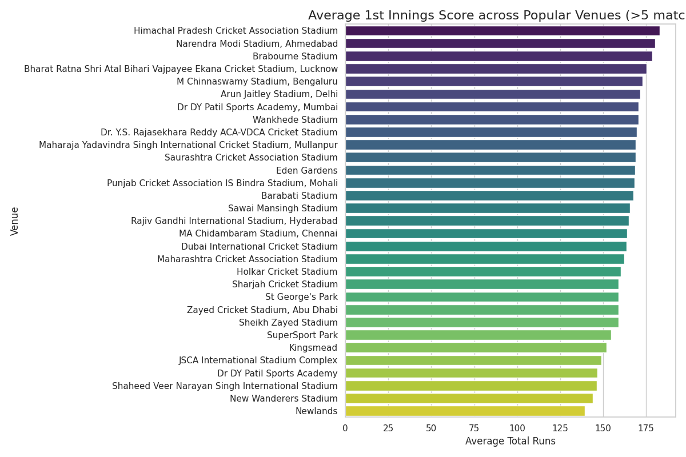

## 6. Venue Analysis (Ground Advantage) - Certain grounds heavily favor defending scores (e
> [!TIP]
> Certain grounds heavily favor defending scores (e.g., Himachal Pradesh Cricket Association Stadium), while others favor chasing (e.g., SuperSport Park).

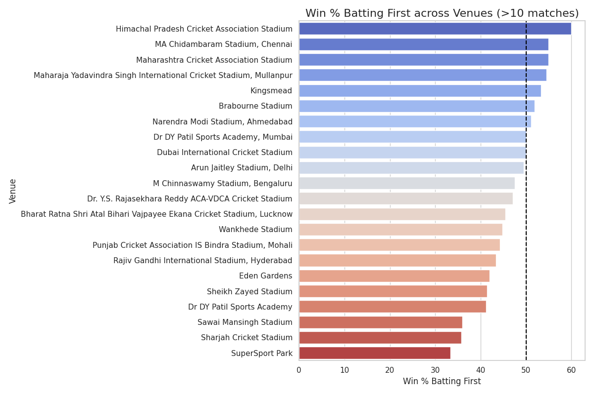

## 7. Match Dynamics - Middle overs see the most total wickets (5009), while death overs see an accelerated wicket rate
> [!TIP]
> Middle overs see the most total wickets (5009), while death overs see an accelerated wicket rate.

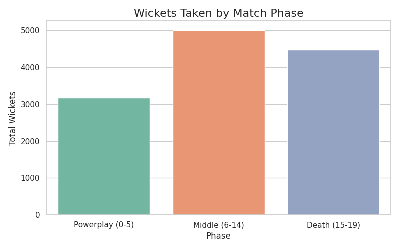

## 8. Player Statistics (Bowlers/Fielders) - Caught is overwhelmingly the most common mode of dismissal (8665 times), followed by bowled
> [!TIP]
> Caught is overwhelmingly the most common mode of dismissal (8665 times), followed by bowled.

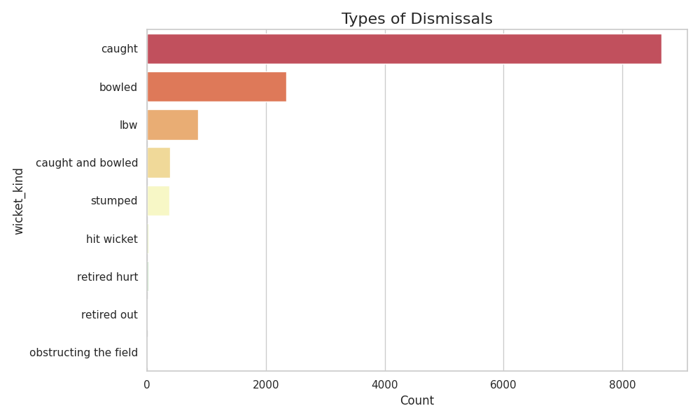

## 9. Player Statistics (Batters) - V Kohli is the leading run-scorer in IPL history with 8671 runs
> [!TIP]
> V Kohli is the leading run-scorer in IPL history with 8671 runs.

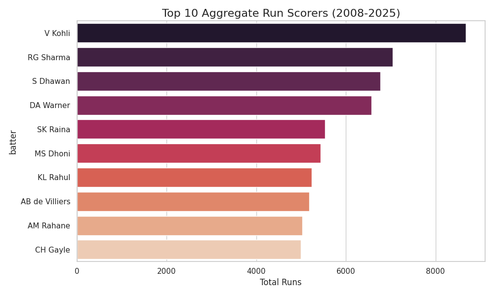

## 10. Match Dynamics (Time Series) - Run Rates have evolved over time, highlighting shifts in batting mentalities and rule changes like the Impact Player rule
> [!TIP]
> Run Rates have evolved over time, highlighting shifts in batting mentalities and rule changes like the Impact Player rule.

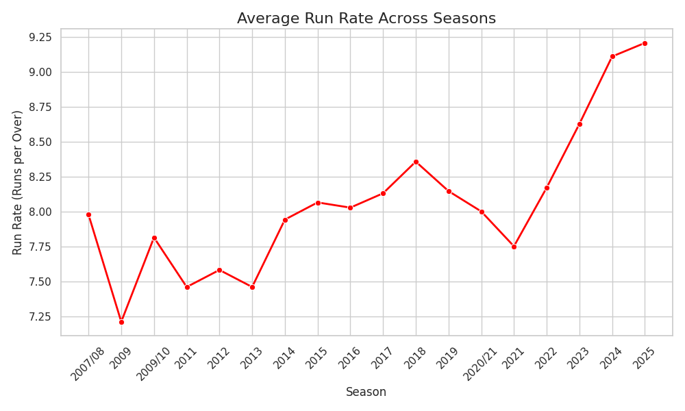

## 11. Player Statistics (Bowlers) - YS Chahal is the leading wicket-taker with 221 wickets
> [!TIP]
> YS Chahal is the leading wicket-taker with 221 wickets.

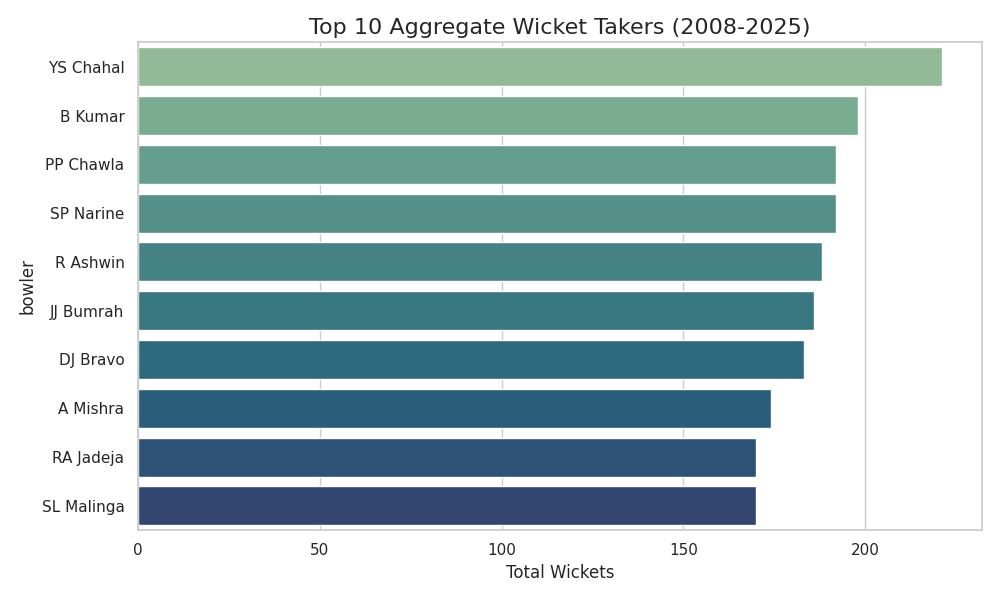

## 12. Match Dynamics - Winning the toss gives a slight edge, resulting in a win 50
> [!TIP]
> Winning the toss gives a slight edge, resulting in a win 50.6% of the time overall.

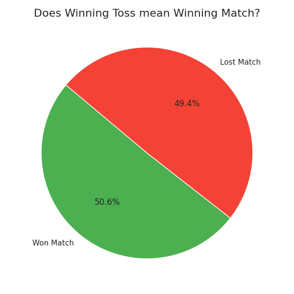

